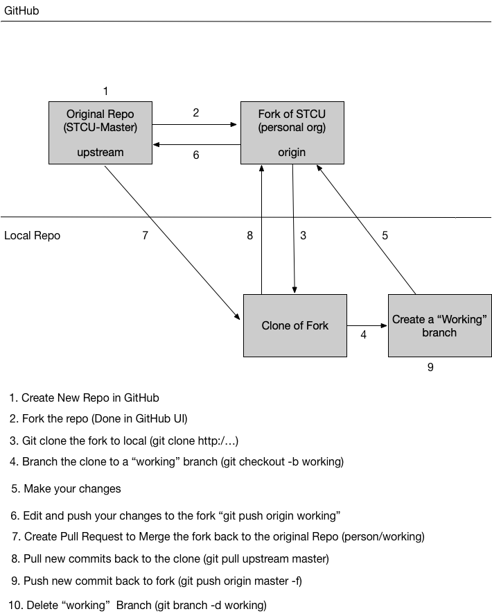

# Git.Helper
Just a simple Site to help me remember stuff

## Typical Workflow

The typical workflow is:

* Fork the main Repo
* Make changes to the Fork
* Create Pull request to merge changes back to main

More details here:



For this exmample, I will use 2 GitHub Oranizations:

1. mark-demo-org
2. malevinso

I will use malevinso as the "Master" org where the final code  repo will be maintained. I will use mark-demo-org as the "working" org where I will for the main repos from malevinso.

### Connect Github to local 

1. Create a new Repo in GitHub (from UI) - Initialize with README
2. Fork Repo you want to work on 
    * Go to Repo you want to fork (malevinso/Git.Helper)
    * Select the Fork Icon in the upper right
    * Select the organization you want to put the fork (marks-demo-org)
3. Clone the fork to your local Repo
    * ````git clone https://github.com/mark-demo-org/Git.Helper.git```` 
    e.g., for this repo
    * Add the upstream repo:
      ````git remote add upstream https://github.com/malevinso/Git.Helper.git````
    * Run this command: 
        ````git remote -v```` you sould see:
        ````yaml
        origin  https://github.com/marks-demo-org/Git.Helper.git (fetch)
        origin  https://github.com/marks-demo-org/Git.Helper.git (push)
        upstream https://github.com/malevinso/Git.Helper.git (fetch)
        upstream https://github.com/malevinso/Git.Helper.git (push)
        ````


4. Create a new branch. 
    
    ````
    λ git checkout -b working-branch
    Switched to a new branch 'working-branch'
    ````
    We are now working on a new branch in this case called 'working-branch'


5. Now I will make some changes to the file and you can see:
    ````
    λ git status
    On branch working-branch
    Changes not staged for commit:
    (use "git add <file>..." to update what will be committed)
    (use "git checkout -- <file>..." to discard changes in working directory)

            modified:   README.md

    no changes added to commit (use "git add" and/or "git commit -a")

    ````
    Notice we have 1 modiied file.

### Push changes back to Fork
6. First we can add the files to prepare a commit
    ````
    λ git add -A

    λ git status
    On branch working-branch
    Changes to be committed:
    (use "git reset HEAD <file>..." to unstage)

        modified:   README.md

    ````
    1. Now you can create a commit
    ````
    λ git commit -m "Commit README"
    [working-branch e5597a2] Commit README
    1 file changed, 93 insertions(+), 2 deletions(-)
    rewrite README.md (71%)
    ````
    >Notice the working branch and the SHA(unique id of the commit)


    2. Finally we can push them back to the Forked Repo (Keeping the working-branch)
    ````
    λ git push origin working-branch
    Enumerating objects: 8, done.
    Counting objects: 100% (8/8), done.
    Delta compression using up to 6 threads
    Compressing objects: 100% (4/4), done.
    Writing objects: 100% (6/6), 1.67 KiB | 853.00 KiB/s, done.
    Total 6 (delta 1), reused 0 (delta 0)
    remote: Resolving deltas: 100% (1/1), done.
    remote:
    remote: Create a pull request for 'working-branch' on GitHub by visiting:
    remote:      https://github.com/marks-demo-org/Git.Helper/pull/new/working-branch
    remote:
    To https://github.com/marks-demo-org/Git.Helper.git
    * [new branch]      working-branch -> working-branch
    ````


### Create a Pull Request to Request Update to Main Repo

7. Create PR to update the Main Repo

Very simple, just go to the upstream rep that you want to merge into and click New Pull Request

    1. make sure you have the correct branch    malevinso/GitHelper (Master) <- marks-demo-org/GitHelper(working-branch)
    2. Merge the PR

now we have on the master branch: 
````
commit a46dc0b23bb2f3ecd4036e432ea01004a12991d8 (HEAD -> master, upstream/master, origin/master, origin/HEAD)
Merge: 5d147c4 7063407
Author: malevinso <malevinso@gmail.com>
Date:   Fri Jun 7 11:05:10 2019 -0600

    Merge pull request #1 from marks-demo-org/working-branch

    Commit README

commit 70634070c6af2ffb08c6c48f12d3825e4a273f68
Author: Mark Levinson <malevinso@gmail.com>
Date:   Wed Jun 5 15:28:58 2019 -0600

    Commit README

commit 5d147c471dc7ba128576caa8bdd6ea5e718a4c17
Author: malevinso <malevinso@gmail.com>
Date:   Wed Jun 5 14:37:33 2019 -0600

    Initial commit
````


8. Update your local repo (from master)

````
git pull upstream master
````

9. Update your fork:

````
git push orgin master -f
````

10. Delete Working Branch
````
git branch -D working-branch
````


## What if the PR fails? 
E.g., Can't Merge Automatically

>This is where it gets tricky.
    This can  happen when the master branch on the base Repo got updated out from under you. Now we have to "rebase" our changes on top of those new changes and update our PR. 

### Create new use case for this:

  For this use case I created 2 branches:
  1. first-change
  2. second-change

  I will make a change to the README on the first-change and create a PR.

  However, prior to merging the pull request, I will another change, similar to the first on the second-change branch. Create a PR, and merge it.

  Now the first-change PR will probably give us a "Can't automatically merge" error.  

  first thing to do is update master branch:


  ````
  git checkout master
  git pull upstream master
  ````

  Now I can rebase first-change from master
  ````
  git checkout first-change
  git rebase master
  ````

  after performing these commands, it is not happy with me (as expected):

  ````
λ git rebase master
First, rewinding head to replay your work on top of it...
Applying: first-change branch
Using index info to reconstruct a base tree...
M       README.md
Falling back to patching base and 3-way merge...
Auto-merging README.md
CONFLICT (content): Merge conflict in README.md
error: Failed to merge in the changes.
hint: Use 'git am --show-current-patch' to see the failed patch
Patch failed at 0001 first-change branch
Resolve all conflicts manually, mark them as resolved with
"git add/rm <conflicted_files>", then run "git rebase --continue".
You can instead skip this commit: run "git rebase --skip".
To abort and get back to the state before "git rebase", run "git rebase --abort".
````

The reason is, it knows that the changes applied with the second change, conflict with the changes applied to master via first-change.  (which we planned)

We now need to open up the file, and remediate the problem:

````
<<<<<<< HEAD
  -- Working on the use case now -- SECOND CHANGE
=======
This is the first change here
>>>>>>> first-change branch
````

This shows that the HEAD of master shows the line as working on the use case now --SECOND CHANGE which we added during our second change branch and PR/MERGE
And it shows the conflicting line "this is the first change here" made via the first-change branch we are trying to add. 

So I opened up the file and fix the line to this:

-- Working on the use case now -- SECOND CHANGE and FIRST CHANGE

then I did a the following:
````
git add README.md
git rebase --continue
git commit --amend
git push origin first-change -f
<Merged PR request from Web Page>
git checkout master
git pull upstream master
```

I added the fixed README.md to the current commit set
I told rebase to finish based on my new file
I amended my current PR with --amend
I pushed the fixed file with the second-change commits to first-change branch and forced it
I merged the PULL request 
and I went back to master
and I updated from the upsteram master branch

````

````
λ git log

commit 16b69043b2f70cde295d71f2e015e0df2d3f5aa0 (HEAD -> master, upstream/master)                     
Merge: 9b41774 33452f7                                                                                
Author: malevinso <malevinso@gmail.com>                                                               
Date:   Fri Jun 7 14:58:30 2019 -0600                                                                 
                                                                                                      
    Merge pull request #2 from marks-demo-org/first-change                                            
                                                                                                      
    First change                                                                                      
                                                                                                      
commit 33452f7e5b312f32d784652354ec842fb46f4cce (origin/first-change)                                 
Author: Mark Levinson <malevinso@gmail.com>                                                           
Date:   Fri Jun 7 11:52:04 2019 -0600                                                                 
                                                                                                      
    first-change branch                                                                               
                                                                                                      
commit 9b417748098e715ce8d3624fd2eb69f19284c209                                                       
Merge: a46dc0b 8b33b29                                                                                
Author: malevinso <malevinso@gmail.com>                                                               
Date:   Fri Jun 7 14:50:38 2019 -0600                                                                 
                                                                                                      
    Merge pull request #3 from marks-demo-org/second-change                                           
                                                                                                      
    Second change                                                                                     
                                                                                                      
commit 8b33b292a4fb63724d99a4db1458247aafd049bc (origin/second-change)                                
Author: Mark Levinson <malevinso@gmail.com>                                                           
Date:   Fri Jun 7 11:58:02 2019 -0600                                                                 
                                                                                                      
    second-change branch                                                                              
                                                                                                      
commit 0cd53193d1d64aebe24d09b639fb7ec0b4e25f6f                                                       
Author: Mark Levinson <malevinso@gmail.com>                                                           
Date:   Fri Jun 7 11:48:59 2019 -0600                                                                 
                                                                                                      
    first change to README.md                                                                         
                                                                                                      
commit a46dc0b23bb2f3ecd4036e432ea01004a12991d8 (origin/master, origin/HEAD)                          
Merge: 5d147c4 7063407                                                                                
Author: malevinso <malevinso@gmail.com>                                                               
Date:   Fri Jun 7 11:05:10 2019 -0600                                                                 
                                                                                                      
    Merge pull request #1 from marks-demo-org/working-branch                                          
                                                                                                      
    Commit README                                                                                     
                                                                                                      
commit 70634070c6af2ffb08c6c48f12d3825e4a273f68                                                       
Author: Mark Levinson <malevinso@gmail.com>                                                           
Date:   Wed Jun 5 15:28:58 2019 -0600                                                                 
                                                                                                      
    Commit README                                                                                     
                                                                                                      
commit 5d147c471dc7ba128576caa8bdd6ea5e718a4c17                                                       
Author: malevinso <malevinso@gmail.com>                                                               
Date:   Wed Jun 5 14:37:33 2019 -0600                                                  ````

